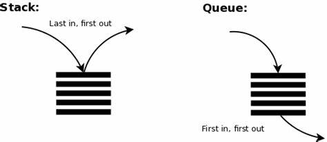

# Implementasi Stack dan Queue dalam PHP

Repositori ini berisi contoh kode PHP untuk mengimplementasikan struktur data stack dan queue. Stack dan queue adalah struktur data linear yang mengikuti aturan tertentu untuk operasinya. Mereka umumnya digunakan dalam berbagai aplikasi.

## Stack

Stack adalah struktur data linear yang mengikuti prinsip Last In First Out (LIFO), yang berarti elemen terakhir yang ditambahkan akan menjadi yang pertama dihapus. Ini mirip dengan tumpukan barang, di mana Anda hanya dapat mengakses atau melihat elemen paling atas. Berikut adalah contoh penerapannya dalam kehidupan sehari-hari:

### Stack dalam Kehidupan Sehari-hari: Menumpuk Piring di Dapur

- Inisialisasi tumpukan untuk mewakili tumpukan piring.
- Ketika mencuci piring baru, letakkan piring tersebut di atas tumpukan (push).
- Ketika Anda ingin menggunakan piring, ambil piring teratas dari tumpukan (pop).
- Piring terakhir yang diletakkan adalah yang pertama digunakan.

## Queue

Queue adalah struktur data linear yang mengikuti prinsip First In First Out (FIFO), yang berarti elemen pertama yang ditambahkan akan menjadi yang pertama dihapus. Ini mirip dengan antrian orang yang menunggu. Berikut adalah contoh penerapannya dalam kehidupan sehari-hari:

### Queue dalam Kehidupan Sehari-hari: Antrian di Loket Pembayaran Tiket

- Inisialisasi antrian pelanggan untuk mewakili pelanggan yang menunggu di depan loket pembayaran tiket.
- Ketika seorang pelanggan datang untuk membeli tiket, tambahkan pelanggan tersebut ke dalam antrian (enqueue).
- Setelah pelanggan membeli tiket dan selesai, loket memanggil pelanggan pertama dalam antrian (dequeue) untuk membayar tiketnya.
- Pelanggan yang sudah membayar tiketnya akan pergi ke tempat tunggu kereta atau pesawat.
- Pelanggan yang pertama datang akan dilayani pertama kali (FIFO).

## Contoh Kode

'''php

<?php
// Inisialisasi tumpukan piring
$stack = [];

// Menambahkan piring ke tumpukan
array_push($stack, "Piring 1");
array_push($stack, "Piring 2");
array_push($stack, "Piring 3");

// Mengambil piring dari tumpukan
$topPlate = array_pop($stack);
echo "Menggunakan piring: $topPlate\n"; // Output: Menggunakan piring: Piring 3

// Piring terakhir yang diletakkan adalah yang pertama diambil (LIFO).
'''
